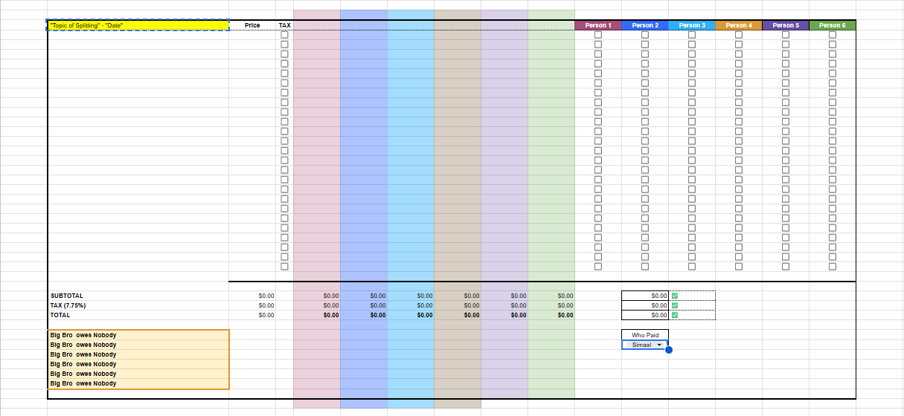
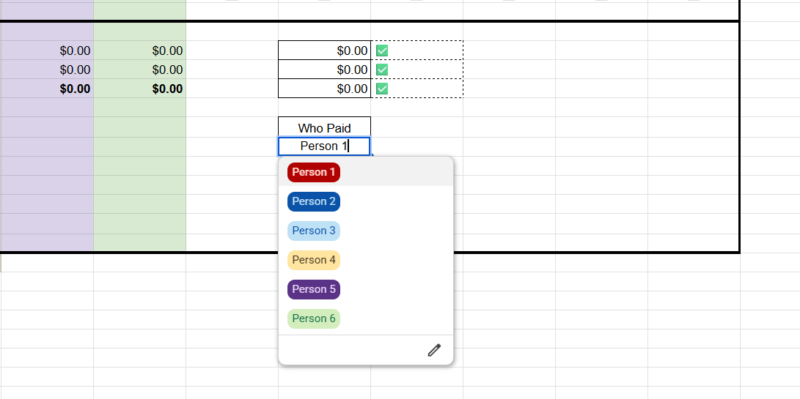

# Group Expense Splitter

A Google Sheets template for splitting shared expenses across up to 6 people — groceries, Costco runs, dinners, activities, utilities, or anything else. Handles per-item splitting, automatic tax calculation, and a smart "Who Paid" system that tells everyone exactly what they owe.

Built at the start of college to solve a real problem: splitting Costco runs where not everyone buys every item, and one person always pays upfront.

---

## Preview





---

## The Problem

When a group shares expenses, the math is rarely clean:
- Not everyone wants every item
- Tax only applies to certain items
- One person pays the full receipt upfront
- Someone has to figure out who owes what and chase everyone down

Existing apps either overcomplicate it or don't handle partial splits well. A spreadsheet does it better.

---

## How It Works

### 1. Enter your items
Add each item's name and price in the list. Each row is one expense.

### 2. Check the tax box
If an item is taxable, check the TAX checkbox for that row. Tax (7.75%) is calculated only on checked items — non-taxable items like deposits are excluded automatically.

### 3. Check who's splitting each item
Each person has a checkbox column. Check whoever is splitting that item. The formula divides the cost evenly among only the checked people — so if 3 out of 6 people want something, only those 3 are charged their share.

### 4. Select who paid
Use the **"Who Paid"** dropdown to select whoever paid the full bill. The sheet immediately outputs exactly what each other person owes that one person.

### 5. Track over time
Each trip or expense session gets its own duplicated sheet, stacked below the previous one in the same file — giving you a running log of every split.

---

## Key Features

- **Supports 1–6 people** per sheet
- **Per-item splitting** — not everyone has to split everything equally
- **Automatic tax calculation** — applied only to flagged taxable items
- **Flexible payer** — any person can be selected as the one who paid
- **Built-in validation** — ✅/❌ indicators confirm all shares sum correctly to the total
- **Readable output** — generates plain-English statements like *"Person 2 owes Person 1 $47.13"*
- **Color-coded columns** — each person's column has a distinct color for quick scanning

---

## Formulas Breakdown

### Per-person share
```
=IF(K5=TRUE, IFERROR($B5 / COUNTIF($K5:$P5, TRUE), 0), "")
```
Checks if the person's checkbox is ticked. If yes, divides the item price by the count of people splitting it (`COUNTIF` counts the TRUE values). `IFERROR` handles edge cases like no one being checked.

### Tax (taxable items only)
```
=SUMIF($D5:$D29, TRUE, E5:E29) * 0.0775
```
Sums each person's share only for rows where the TAX checkbox is TRUE, then applies the tax rate. Non-taxable items are automatically excluded.

### Totals validation
```
=IF(L34=C34, "✅", "❌")
```
Confirms the sum of all individual shares matches the overall total — instant visual check that the math is right.

### "Who Paid" owe calculation
```
=IF($K37=K4, "Big Bro "&$K37&" owes Nobody", K4&" owes "&$K37&" $"&TEXT(E34,"0.00"))
```
Reads the selected payer from the dropdown. If a person's name matches the payer, they get a "owes Nobody" message. Everyone else gets a formatted dollar amount.

---

## How to Use

1. **Open** `templates/Group_Expense_Splitter_v2.xlsx` and import it into Google Sheets (File → Import, or just open with Google Sheets directly)
2. **Rename the people** in the header row to your group's actual names
3. **Update the "Who Paid" dropdown** — right-click the dropdown cell → Data validation → update the list to match your names
4. For each new expense session, **duplicate the sheet tab** and rename it (e.g. "Costco - May 21")
5. Fill in items, check the boxes, select who paid — the rest is automatic

---

## Versions

| Version | People Supported | Notes |
|---------|-----------------|-------|
| v1.0 | Up to 4 | Original build |
| v2.0 | Up to 6 | Expanded group size, refined structure, cleaned up layout |

See [CHANGELOG.md](CHANGELOG.md) for full details.

---

## What I'd Add in a Future Version

- Support for 8+ people
- A summary tab that aggregates totals across all sessions
- Running balance tracker showing who has paid more over time
- Percentage-based splits in addition to equal splits

---

## License

MIT — see [LICENSE](LICENSE) for details.
